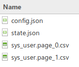
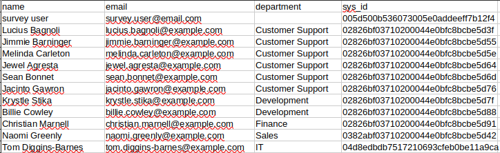
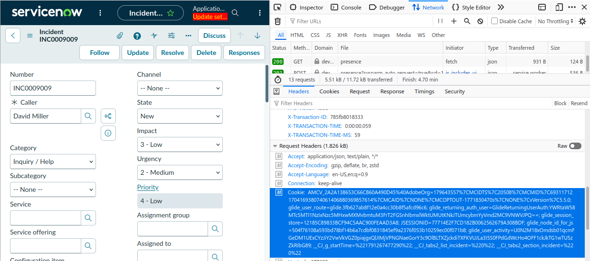

## Dave's SN Exporter Tool
A tool for exporting data from a ServiceNow instance.

Exporting over 1,000 rows of data out of ServiceNow can be difficult and tedious. This tool follows the method on ServiceNow Docs of exported data in "pages" or "chunks".

Features
* Export unlimited data from ServiceNow from any table your user has access to (default: pages of 1,000 rows).
* Exports data as comma-separated files (CSV).
* Exports using the URL export features, no need for Table API access. Any user can do it!
* Can export display values or system values.
* Authenticate as your browser's session, compatible with SSO authentication.
* Configuration files can be used for regular exports, instead of configuring everything through the command line.
* Resume support, great for resuming an export that was interrupted.
* Delta exports, only exporting data that's changed since the last export.
* Progress animation while exporting data.
* Few dependancies, should run on any computer with Python3.

## Requirements
* Python 3
* `requests`

Required python packages can be installed using the `requirements.txt` file.

```
pip install -r requirements.txt
```

## Usage
Use this tool in the command line.

Using the export tool will export the data into multiple files, each being **pages** of results, into a **temporary directory** which is `./tmp/` by default.





### Help

```
usage: DavesSnExportTool.py [-h] [--auth-type {none,basic,cookies}] [--auth-username AUTH_USERNAME] [--auth-password AUTH_PASSWORD] [--auth-cookies AUTH_COOKIES]
                            [--instance-url INSTANCE_URL] [--verbose] [--config CONFIG] [--combine-output] [--export-type {csv}] [--export-table EXPORT_TABLE]
                            [--export-fields EXPORT_FIELDS] [--export-query EXPORT_QUERY] [--page-size PAGE_SIZE] [--start-sysid START_SYSID] [--temp-dir TEMP_DIR] [--out OUT]
                            [--display-values DISPLAY_VALUES] [--no-display-values NO_DISPLAY_VALUES] [--min-rows MIN_ROWS] [--state STATE] [--delta-export]
                            [--delta-timestamp DELTA_TIMESTAMP] [--delta-field DELTA_FIELD] [--progress] [--proxy PROXY]

options:
  -h, --help            show this help message and exit
  --auth-type {none,basic,cookies}, -a {none,basic,cookies}
                        Type of authentication to use.
  --auth-username AUTH_USERNAME, -au AUTH_USERNAME
                        Username to authenticate with.
  --auth-password AUTH_PASSWORD, -ap AUTH_PASSWORD
                        Password to authenticate with.
  --auth-cookies AUTH_COOKIES, -ac AUTH_COOKIES
                        When using cookies auth, a semi-colon separated list of cookies to use.
  --instance-url INSTANCE_URL, -i INSTANCE_URL
                        Base URL of the SN instance. E.g. myinstance.service-now.com
  --verbose, -v         Enable verbose logging.
  --config CONFIG, -c CONFIG
                        Load config from config file.
  --combine-output, -C  Combine the pages of results into 1 output file. Not recommended for multi-GB size exports.
  --export-type {csv}, -e {csv}
                        Type of export.
  --export-table EXPORT_TABLE, -t EXPORT_TABLE
                        Name of the table to export data from.
  --export-fields EXPORT_FIELDS, -f EXPORT_FIELDS
                        List of fields to export, comma-separated, or '*' for all fields.
  --export-query EXPORT_QUERY, -q EXPORT_QUERY
                        Query to use when exporting data.
  --page-size PAGE_SIZE, -S PAGE_SIZE
                        How many rows to export per page.
  --start-sysid START_SYSID, -r START_SYSID
                        The sys_id to start exporting from (not including the sys_id). Useful for resuming a failed export. Overrides the last sysid in the state file.
  --temp-dir TEMP_DIR, -T TEMP_DIR
                        Directory to save temporary files to.
  --out OUT, -o OUT     Name of file to output the export to. Pages of results will also use this name.
  --display-values DISPLAY_VALUES, -d DISPLAY_VALUES
                        Enable display values when exporting data.
  --no-display-values NO_DISPLAY_VALUES, -D NO_DISPLAY_VALUES
                        Disable display values when exporting data.
  --min-rows MIN_ROWS, -m MIN_ROWS
                        The minimum amount of rows to export. Useful when there's lots of data 'hidden for security reasons' and may result in an empty page of data. If not provided,
                        export will end on the 1st empty page of data.
  --state STATE, -s STATE
                        State file location. Used for tracking page number for resume support, and delta timestamp to export data after last export.
  --delta-export, -X    Enable delta exports, only exporting data sys_updated_on since the last export.
  --delta-timestamp DELTA_TIMESTAMP, -x DELTA_TIMESTAMP
                        Add a sys_updated_on query to only export data updated after the given timestamp. Must be correctly formatted UTC timestamp YYYY-MM-DD HH:MM:SS. Leave blank if
                        you want to use what's in the state file.
  --delta-field DELTA_FIELD, -F DELTA_FIELD
                        The field to filter the delta timestamp on. Default: sys_updated_on
  --progress, -P        Show progress while exporting.
  --proxy PROXY, -p PROXY
                        Web proxy address to use, authentication must be in-line. http://<ip>:<port> or http://<username>:<password>@<ip>:<port>
```

**Note:** The sys_id column is included in every export due to how the tool exports data.

### Example 1
Exporting all user records with only the fields "name", "email", and "phone number". Show progress animation.

```
python3 ./DavesSnExportTool.py --progress --instance-url "dev123456.service-now.com" --export-table sys_user --export-fields "name,email,department" --out "sys_user" --auth-type cookies --auth-cookies "<browser cookies>"
```

### Example 2
The same, but using shorthand arguments.

```
python3 ./DavesSnExportTool.py -P -i "dev123456.service-now.com" -t sys_user -f "name,email,department" -o "sys_user" -a cookies -ac "<browser cookies>"
```

### Example 3
The same, but using a configuration file.

```
python3 ./DavesSnExportTool.py -c ./tmp/config.json
```

The config file in `./tmp/config.json`
```json
{
    "instance_url": "dev123456.service-now.com",
    "auth_type": "cookies",
    "auth_cookies": "<browser cookies>",
    "export_table": "incident",
    "export_fields": "name,email,department",
    "out_file": "sys_user",
    "progress": "true"
}
```

### Example 4
Export incidents with a query for only incidents with a category of "Inquery / Help" OR a service name of "email".

```
python3 ./DavesSnExportTool.py -i dev123456.service-now.com -t incident -o incident_feed -f "*" --query "category=inquiry^ORbusiness_service.name=email" --auth-type cookies --auth-cookies "<browser cookies>"
```

### Example 5
Export incidents with all fields, but only export incidents that have changed since the last export. A **delta** export.

```
python3 ./DavesSnExportTool.py -i dev123456.service-now.com -t incident -o incident_feed -f "*" --state ./tmp/state.json --delta-export --auth-type cookies --auth-cookies "<browser cookies>"
```

* 1st run: export's everything, saves the date & time to the state file.
* future runs: filters data to only what's changed since the last run.

## Cookie authentication
The export tool can authenticate using your browser's ServiceNow session. To do this, we'll need to get your **cookies** to the tool.

1. In your web browser, open the instance of ServiceNow you'll be exporting data from.
2. Open the **developer tools** (Chrome & Firefox: press F12).
3. Open the **Network** tab. If there are no results, reload the page.
4. Click on any of the results, search for **Request Headers** then **Cookie**. Copy the entire value for Cookie.



5. Use the export tool and paste in cookie value after `--auth-cookies--`

Example:
```
python3 DavesSnExportTool.py --instance-url dev123456.service-now.com --export-table incident --auth-type cookies --auth-cookies "JSESSIONID=77714E2F7CD182B0062562679A308BDF; glide_node_id_for_js=504f76108a593bd78bf14b6a7cdbf0831845ef9a2376f053b10259ec00f071b8;..."
```

## Can't use "new query" or "order by"
Due to the way that the tool exports data (sorted by sys_id), queries cannot include:
* ^NQ or "new query"
* ^ORDERBY or ordering within the query

## Combining very large reports
It is possible for this tool to combine lots of rows of data into 1 large CSV file. However, there are limits to what tools like Excel will be able to open.

If you are exporting gigabytes of data, I'd recommend leaving them as separate files, instead of combining them into 1 large file.

## Wish list
### Browser authentication
Support for automatically fetching authentication cookies from your browser may not be possible. The session cookies are tied to the browser's session, and are deleted once the browser is closed.

I may look at this in a future version, but for now, the cookie copy & paste method works.

### Advanced proxies
Like many non-browser tools, this tool is compabile with basic HTTP/HTTPS proxies, however it's not currently compatible with:
* NTLM / kerberos authenticated proxies (Windows-auth)
* SOCKS proxies
* PAC-file configured proxies

Some Windows proxy tools can be used to bridge through to your kerberos-authenticated proxy. Do so at your own risk.
* Px (https://github.com/genotrance/px)
* WinPX (https://apps.microsoft.com/detail/9pk1pt0skm0q)
* Winfoom (https://github.com/ecovaci/winfoom)

To truely overcome all proxy configurations, I feel this tool would need to become a browser plugin and use the browser's proxy functionality. Maybe in a future version.